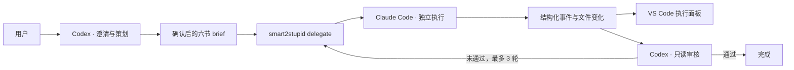

# smart2stupid

> Codex 负责想清楚，Claude Code 负责把事情做完。

smart2stupid 是一套 VS Code 内的双 Agent 开发工作流：右侧使用官方 Codex 对话完成需求澄清、任务 brief 和结果审核；VS Code 左侧 Activity Bar 提供独立入口，结构化展示 Claude Code 收到的完整指令、回复、工具调用、命令、文件变化、测试、错误、token 用量与状态。

正常工作流不启动 Web UI、不弹出浏览器，也不需要人工复制粘贴 Codex 与 Claude 之间的消息。

## 核心特性

- **严格分工**：Codex 是需求负责人和审核者，Claude Code 是唯一实施者。
- **完整可见**：Claude 的 handoff、工具调用、命令、结果、错误和变更实时写入 VS Code 面板。
- **Token 审计**：Claude 返回的总输入、输出、缓存输入、费用和分模型明细随轮次落盘并显示。
- **持久会话**：首轮创建官方 Claude session，修正轮默认使用同一个 session 继续执行。
- **自动闭环**：用户确认一次 brief；之后 Codex 审核，不通过则自动发送最小修正指令，默认最多 3 轮。
- **高权限执行**：Claude 使用 `bypassPermissions` 自动完成写文件、运行命令、安装依赖、测试等工作。
- **删除保护**：递归删除和常见批量删除命令通过 Claude Code CLI deny 规则强制拒绝。
- **可审计记录**：任务状态、脱敏事件、工作区基线、变更清单和审核结论落盘到 `.smart2stupid/`。
- **无浏览器依赖**：旧 Web UI 仅保留为显式备用入口。

## 工作方式



一次执行轮次的边界是完整 handoff 到终态结果。Claude 开始后，Codex 不发送中途指令；Claude 会独立运行到完成、失败、阻塞或取消。涉及功能、范围、数据风险、危险操作或验收标准变化时，流程回到用户确认。

## 组成

| 组件 | 作用 |
| --- | --- |
| `skill-package/smart2stupid/` | `$smart2stupid` Codex 技能，负责追问、brief、派单和审核规则 |
| `src/delegate.ts` | 无 HTTP 委派入口，管理 Claude session、轮次、快照和审计事件 |
| `src/executors/` | Claude/Codex/Qwen/通用 CLI 执行器适配层 |
| `vscode-extension/` | VS Code 结构化执行面板和会话控制按钮 |
| `.smart2stupid/` | 本地任务记录；默认被 Git 忽略 |

## 环境要求

- VS Code `1.85+`
- Node.js `20+`
- 官方 Codex VS Code 扩展
- 官方 Claude Code VS Code 扩展
- 可在终端运行的 Claude Code CLI，并已完成认证

当前主要在 Windows + PowerShell 环境验证。核心 Node.js 代码不依赖 Windows API，但扩展安装示例以 Windows 为主。

## 安装

### 1. 克隆并构建主项目

```powershell
git clone https://github.com/ttsdj/smart2stupid.git
cd smart2stupid
npm ci
npm run typecheck
npm test
npm run build
```

### 2. 构建并安装 VS Code 扩展

```powershell
npm ci --prefix .\vscode-extension
npm run compile --prefix .\vscode-extension
npm run package --prefix .\vscode-extension
$latestVsix = Get-ChildItem '.\vscode-extension\smart2stupid-ui-*.vsix' |
  Sort-Object LastWriteTime |
  Select-Object -Last 1
code --install-extension $latestVsix.FullName --force
```

安装后在 VS Code 命令面板执行 `Developer: Reload Window`。

### 3. 安装 Codex skill

将 `skill-package/smart2stupid` 复制到 Codex skills 目录。Windows 示例：

```powershell
$codexSkillRoot = Join-Path $env:USERPROFILE '.codex\skills'
New-Item -ItemType Directory -Force -Path $codexSkillRoot
Copy-Item -Recurse -Force '.\skill-package\smart2stupid' $codexSkillRoot
```

重新加载 VS Code 或新开 Codex 会话后，显式调用 `$smart2stupid`。

## 使用

在右侧 Codex 对话中输入：

```text
$smart2stupid 为当前项目增加用户登录功能，先和我确认数据结构与验收标准
```

随后流程为：

1. Codex 读取当前工作区与项目说明。
2. Codex 以设计树形式集中追问尚未明确的产品决策，并给出推荐答案。
3. Codex 展示完整六节 brief，请求一次明确确认。
4. 确认后，Codex 启动 delegate；VS Code 左侧 Activity Bar 的 smart2stupid 入口自动获得焦点并显示 Claude 实时执行。
5. Claude 独立执行，Codex 不在本轮中途干预。
6. Claude 结束后，Codex 检查基线差异、Git diff、源码和测试，并记录通过或修正意见。

面板支持：

- 停止当前 Claude 执行
- 在官方 Claude Code 扩展中打开已建立的 session
- 在编辑区展开完整执行面板
- 让下一轮创建新 session
- 在默认 3 轮之外追加一轮

如果自动面板没有出现，可运行：

```text
smart2stupid: 打开左侧执行视图
```

也可以直接点击 VS Code 左侧 Activity Bar 中的 smart2stupid 星形执行图标。

## Token 统计口径

Claude 执行端的 `result.usage` 与 `result.modelUsage` 会写入当前轮次的 `delegate-state.json`，并在左侧视图中展示。若运行时使用辅助模型，总数按所有 `modelUsage` 条目汇总，分模型数据仍完整保留。按 Anthropic 的 usage 口径，总处理量为普通输入、缓存读取、缓存写入和输出四项之和；UI 会将它们分开显示。

原生 Codex VS Code 对话目前没有被本扩展拦截，因此不会伪造“当前聊天”的精确 token。做可复现的 smart 端基准时，可使用 `codex exec --json --ephemeral`，读取末尾 `turn.completed.usage`；OpenAI Responses API 接入则应读取响应对象的 `usage` 字段。

## Claude 执行权限

默认 Claude 执行器使用：

```text
--permission-mode bypassPermissions
```

因此未命中 deny 规则的工具调用会自动执行，不在无头任务中等待权限弹窗。当前强制拒绝的命令族配置在 `config/config.default.json` 的 `stupid.disallowedTools`，包括：

- `rm` 的 `-r`、`-R`、`--recursive` 形式
- PowerShell `Remove-Item -Recurse`
- Windows `rmdir /s`、`rd /s`、`del /s`、`erase /s`
- `find -delete`
- 强制 `git clean`
- 常见 Python `shutil.rmtree` 和 Node.js recursive `fs.rm` 调用

这些是 Claude Code 权限系统中的 deny 规则，不是提示词建议；deny 在 `bypassPermissions` 下仍然优先。普通 Bash、文件写入、构建、测试和安装命令均可自动执行。

> **安全边界**：命令模式 deny 不是操作系统级文件保护，无法数学上识别任意自定义程序内部的删除逻辑。对不受信任的仓库或需要强隔离的任务，请额外在容器、虚拟机或可回滚工作区中运行。

为了让官方 Claude CLI 保存和恢复 `~/.claude` 会话，Codex 第一次启动 `npm run delegate` 时会请求一个仅针对该命令前缀的沙箱外批准。批准发生在 VS Code 内，不会打开浏览器。

## 配置

默认配置位于 `config/config.default.json`。本机覆盖写入 `config/config.local.json`，该文件不会提交到 Git。

```jsonc
{
  "stupid": {
    "executor": "claude",
    "model": "claude-haiku-4-5-20251001",
    "allowedTools": "Read,Glob,Grep,Edit,Write,NotebookEdit,Bash,WebFetch,WebSearch",
    "disallowedTools": [
      "Bash(rm *-r*)",
      "Bash(*Remove-Item *-Recurse*)",
      "Bash(*git clean *-f*)"
    ],
    "autoApprove": true,
    "budgetUsd": 5,
    "timeoutMs": 1800000
  }
}
```

配置采用 `config.default.json` 与 `config.local.json` 深合并，并支持字符串中的 `${ENV_VAR}` 展开。

### 模型覆盖提醒

Claude Code 自己的用户设置和环境变量仍可能覆盖传入的 `--model`，尤其是配置了第三方 Anthropic 兼容网关时。判断实际请求模型应以 Claude 运行时元数据和网关记录为准，而不是只看 smart2stupid 的 `stupid.model`。

## 审计数据

每个任务写入：

```text
<workdir>/.smart2stupid/
├─ active.json
├─ pending/
└─ sessions/<task-id>/
   ├─ brief.md
   ├─ handoff-<n>.md
   ├─ baseline-<n>.json
   ├─ changes-<n>.json
   ├─ delegate-events.jsonl
   ├─ delegate-state.json
   ├─ review-<n>.md
   └─ control.json
```

面板和事件日志会遮盖常见 API key、Bearer Token、Cookie、Authorization 和密码值。不要在 brief 中主动粘贴秘密；原始输入文件仍由工作区所有者负责保护。

## CLI

通常由 skill 自动调用，也可以手动运行：

```powershell
# 首轮
npm run delegate -- run `
  --workdir "D:\path\to\project" `
  --brief-file "D:\path\to\project\.smart2stupid\pending\brief.md" `
  --max-iterations 3

# 后续修正轮：复用同一 Claude session
npm run delegate -- run `
  --workdir "D:\path\to\project" `
  --task-id "task-..." `
  --feedback-file "D:\path\to\project\.smart2stupid\pending\fix.md"

# 记录 Codex 审核
npm run delegate -- review `
  --workdir "D:\path\to\project" `
  --task-id "task-..." `
  --verdict pass `
  --review-file "D:\path\to\project\.smart2stupid\pending\review.md"
```

## 开发与验证

```powershell
npm test
npm run typecheck
npm run build
npm run compile --prefix .\vscode-extension
```

测试覆盖脱敏、命令模板、全权限 deny 参数、Claude stream-json 事件、跨模型 token 汇总、工具结果、错误展示以及 session 建立/恢复选择。

## 项目目录

```text
smart2stupid/
├─ config/                  # 默认配置与本机覆盖
├─ public/                  # 旧 Web UI 静态资源
├─ skill-package/           # 可安装的 $smart2stupid skill
├─ src/                     # 编排、执行器、审计和旧服务端
├─ tests/                   # Node.js 自动化测试与 fixtures
├─ vscode-extension/        # 结构化执行面板扩展
└─ HANDOVER.md              # 详细设计与移交记录
```

## 旧版 Web UI

旧版 HTTP/Web UI 仍保留用于回归和应急，但不会在默认工作流中启动。只有显式运行以下命令才会打开：

```powershell
npm run dev
```

或在 VS Code 命令面板选择名称中带“旧版 Web UI（备用）”的命令。

## 当前状态

项目处于可用但仍在快速演进阶段。提交 Issue 时建议附上：

- `delegate-state.json` 的脱敏版本
- 对应轮次的错误事件
- Claude Code CLI 与 VS Code 扩展版本
- 可复现步骤
