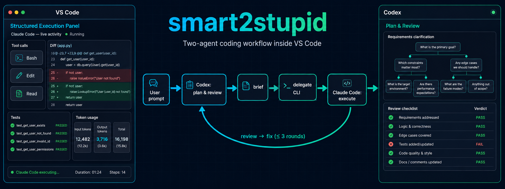
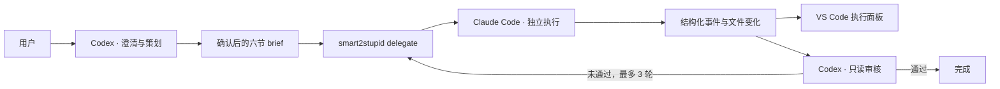

<div align="center">


# smart2stupid

**Codex 负责想清楚，Claude Code 负责把事情做完。**

一套运行在 VS Code 内的双 Agent 开发工作流——聪明模型出脑，廉价模型出力，两端热插拔。

[](https://github.com/ttsdj/smart2stupid/stargazers)
[](https://www.typescriptlang.org/)
[](https://nodejs.org/)
[](https://code.visualstudio.com/)

[架构](#system-architecture) · [快速开始](#quick-start) · [安装](#installation) · [配置](#configuration) · [文档](#documentation)

</div>

<details open>
<summary>📕 目录</summary>

- [💡 什么是 smart2stupid](#what-is-smart2stupid)
- [🌟 核心特性](#key-features)
- [🔎 系统架构](#system-architecture)
- [🎮 快速开始](#quick-start)
- [🛠️ 安装](#installation)
- [🔧 配置](#configuration)
- [🔒 执行权限与删除保护](#execution--permissions)
- [📊 Token 与审计](#token--audit)
- [🔨 CLI](#cli)
- [📚 文档](#documentation)
- [📜 Roadmap](#roadmap)
- [🏄 社区](#community)
- [🙌 贡献](#contributing)

</details>

## 💡 What is smart2stupid?

smart2stupid 把「规划 / 思考阶段需要聪明模型（贵），执行阶段不需要（便宜即可）」这个朴素判断做成了可落地的双 Agent 流水线：

- **右侧官方 Codex 对话**是 smart 端，负责需求澄清（设计树追问）、生成六节 brief、派单、只读审核与修正指令；
- **左侧 smart2stupid 结构化面板**实时展示 stupid 端的执行全过程；
- **Claude Code 是唯一实施者**，真正写代码、跑测试、改文件。

正常路径不启动 Web UI、不弹浏览器，也不需要你在 Codex 与 Claude 之间人工复制粘贴任何消息。

## 🌟 Key Features

- 🧠 **严格分工** —— Codex 是需求负责人与审核者，Claude Code 是唯一实施者，边界清晰。
- 👁️ **完整可见** —— handoff、工具调用、命令、结果、错误、文件变化实时落盘并写入 VS Code 面板。
- 🔁 **自动闭环** —— 用户确认一次 brief，之后 Codex 审核，不通过自动发最小修正指令，默认最多 3 轮。
- 🗃️ **持久会话** —— 首轮创建官方 Claude session，修正轮复用同一 session（`--resume`）。
- 📊 **Token 审计** —— 总输入 / 输出 / 缓存输入 / 费用与分模型明细随轮次落盘显示。
- ⚡ **高权限执行** —— Claude 以 `bypassPermissions` 自动完成写文件、跑命令、装依赖、跑测试。
- 🛡️ **删除保护** —— 递归删除与常见批量删除命令通过 CLI deny 规则强制拒绝。
- 🧾 **可审计记录** —— 状态、脱敏事件、工作区基线、变更清单与审核结论写入 `.smart2stupid/`。
- 🚫 **无浏览器依赖** —— 旧 Web UI 仅作显式备用入口，不参与正常工作流。

## 🔎 System Architecture

<div align="center">

</div>



一次轮次的边界是「完整 handoff → 终态结果」。Claude 开始后，Codex 不发送中途指令，Claude 独立运行到完成、失败、阻塞或取消。涉及功能、范围、数据风险、危险操作或验收标准变化时，流程回到用户确认。

## 🎮 Quick Start

在右侧 Codex 对话中输入：

```text
$smart2stupid 为当前项目增加用户登录功能，先和我确认数据结构与验收标准
```

随后：

1. Codex 读取当前工作区与项目说明；
2. 以设计树形式集中追问尚未明确的产品决策，并给出推荐答案；
3. 展示完整六节 brief，请求一次明确确认；
4. 确认后 Codex 启动 delegate，左侧 Activity Bar 的 smart2stupid 入口自动聚焦，实时显示 Claude 执行；
5. Claude 独立执行，Codex 不在本轮中途干预；
6. Claude 结束后，Codex 检查基线差异、Git diff、源码与测试，记录通过或修正意见。

面板支持：停止当前执行、在官方 Claude Code 扩展中打开已建立 session、在编辑区展开宽版面板、下轮新开 session、在默认 3 轮之外追加一轮。

## 🛠️ Installation

### 1. 克隆并构建主项目

```powershell
git clone https://github.com/ttsdj/smart2stupid.git
cd smart2stupid
npm ci
npm run typecheck
npm test
npm run build
```

### 2. 构建并安装 VS Code 扩展

```powershell
npm ci --prefix .\vscode-extension
npm run compile --prefix .\vscode-extension
npm run package --prefix .\vscode-extension
$latestVsix = Get-ChildItem '.\vscode-extension\smart2stupid-ui-*.vsix' |
  Sort-Object LastWriteTime |
  Select-Object -Last 1
code --install-extension $latestVsix.FullName --force
```

安装后在 VS Code 命令面板执行 `Developer: Reload Window`。

### 3. 安装 Codex skill

```powershell
$codexSkillRoot = Join-Path $env:USERPROFILE '.codex\skills'
New-Item -ItemType Directory -Force -Path $codexSkillRoot
Copy-Item -Recurse -Force '.\skill-package\smart2stupid' $codexSkillRoot
```

重新加载 VS Code 或新开 Codex 会话后，显式调用 `$smart2stupid`。

## 🔧 Configuration

默认配置在 `config/config.default.json`；本机覆盖写入 `config/config.local.json`（不提交 Git）。两层深合并，字符串支持 `${ENV_VAR}` 展开。

```jsonc
{
  "stupid": {
    "executor": "claude",
    "model": "claude-haiku-4-5-20251001",
    "allowedTools": "Read,Glob,Grep,Edit,Write,NotebookEdit,Bash,WebFetch,WebSearch",
    "disallowedTools": [
      "Bash(rm *-r*)",
      "Bash(*Remove-Item *-Recurse*)",
      "Bash(*git clean *-f*)"
    ],
    "autoApprove": true,
    "budgetUsd": 5,
    "timeoutMs": 1800000
  }
}
```

> **IMPORTANT** —— Claude Code 自己的用户设置与环境变量仍可能覆盖传入的 `--model`，尤其是配置了第三方 Anthropic 兼容网关时。判断实际模型应以 Claude 运行时元数据和网关记录为准。

## 🔒 Execution & Permissions

默认 Claude 执行器使用 `--permission-mode bypassPermissions`，未命中 deny 规则的工具调用会自动执行，不在无头任务中等待权限弹窗。强制拒绝的命令族配置在 `stupid.disallowedTools`，包括递归 `rm`、`Remove-Item -Recurse`、`rmdir /s`、`find -delete`、强制 `git clean`、Python `shutil.rmtree`、Node 递归 `fs.rm` 等。

> **CAUTION** —— 命令模式 deny 不是操作系统级文件保护，无法数学上识别任意自定义程序内部的删除逻辑。对不受信任的仓库或需要强隔离的任务，请额外在容器、虚拟机或可回滚工作区中运行。

为了让官方 Claude CLI 保存和恢复 `~/.claude` 会话，Codex 第一次启动 `npm run delegate` 时会请求一个仅针对该命令前缀的沙箱外批准（在 VS Code 内完成，不弹浏览器）。

## 📊 Token & Audit

Claude 执行端的 `result.usage` 与 `result.modelUsage` 写入当前轮次的 `delegate-state.json` 并在面板展示。按 Anthropic 口径，总处理量为普通输入、缓存读取、缓存写入与输出四项之和，UI 分开显示；辅助模型按所有 `modelUsage` 条目汇总并保留分模型明细。

每个任务落盘到 `<workdir>/.smart2stupid/`：

```text
<workdir>/.smart2stupid/
├─ active.json
├─ pending/
└─ sessions/<task-id>/
   ├─ brief.md
   ├─ handoff-<n>.md
   ├─ baseline-<n>.json
   ├─ changes-<n>.json
   ├─ delegate-events.jsonl
   ├─ delegate-state.json
   ├─ review-<n>.md
   └─ control.json
```

面板与事件日志会遮盖常见 API key、Bearer Token、Cookie、Authorization 与密码值。

## 🔨 CLI

通常由 skill 自动调用，也可手动运行：

```powershell
# 首轮
npm run delegate -- run `
  --workdir "D:\path\to\project" `
  --brief-file "D:\path\to\project\.smart2stupid\pending\brief.md" `
  --max-iterations 3

# 后续修正轮：复用同一 Claude session
npm run delegate -- run `
  --workdir "D:\path\to\project" `
  --task-id "task-..." `
  --feedback-file "D:\path\to\project\.smart2stupid\pending\fix.md"

# 记录 Codex 审核
npm run delegate -- review `
  --workdir "D:\path\to\project" `
  --task-id "task-..." `
  --verdict pass `
  --review-file "D:\path\to\project\.smart2stupid\pending\review.md"
```

## 📚 Documentation

- [HANDOVER.md](HANDOVER.md) —— 详细设计、需求清单、验证记录与移交说明
- [docs/architecture.md](docs/architecture.md) —— 架构描述与图像生成提示词

## 📜 Roadmap

- [x] Codex → Claude Code 委派闭环与只读审核
- [x] VS Code 结构化执行面板（Activity Bar + 编辑区宽版）
- [x] Token 审计、脱敏、文件变化与工作区基线
- [ ] 更多 stupid 端执行器实测（Codex CLI、Qwen、ChatGPT 桌面版）
- [ ] 更紧密的 agent 实时对话 / 辩论模式

## 🏄 Community

- 报告问题或提建议：请在 [Issues](https://github.com/ttsdj/smart2stupid/issues) 附上脱敏版 `delegate-state.json`、对应轮次的错误事件、Claude Code CLI 与 VS Code 扩展版本、可复现步骤。

## 🙌 Contributing

欢迎提交 Issue 与 PR。改动前请先跑 `npm test`、`npm run typecheck` 与 `npm run build`，扩展侧再跑 `npm run compile --prefix .\vscode-extension`。

## 项目目录

```text
smart2stupid/
├─ config/                  # 默认配置与本机覆盖
├─ public/                  # 旧 Web UI 静态资源（备用）
├─ skill-package/           # 可安装的 $smart2stupid skill
├─ src/                     # 编排、执行器、审计与旧服务端
├─ tests/                   # Node.js 自动化测试与 fixtures
├─ docs/                    # 架构图、logo 与提示词文档
├─ vscode-extension/        # 结构化执行面板扩展
└─ HANDOVER.md              # 详细设计与移交记录
```
